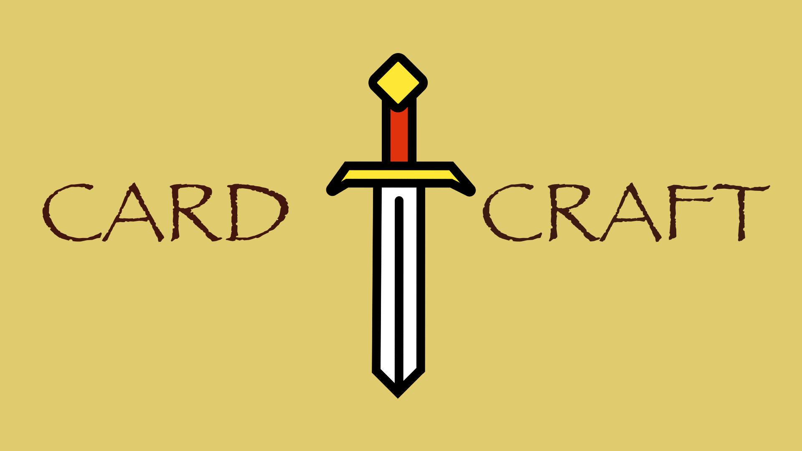
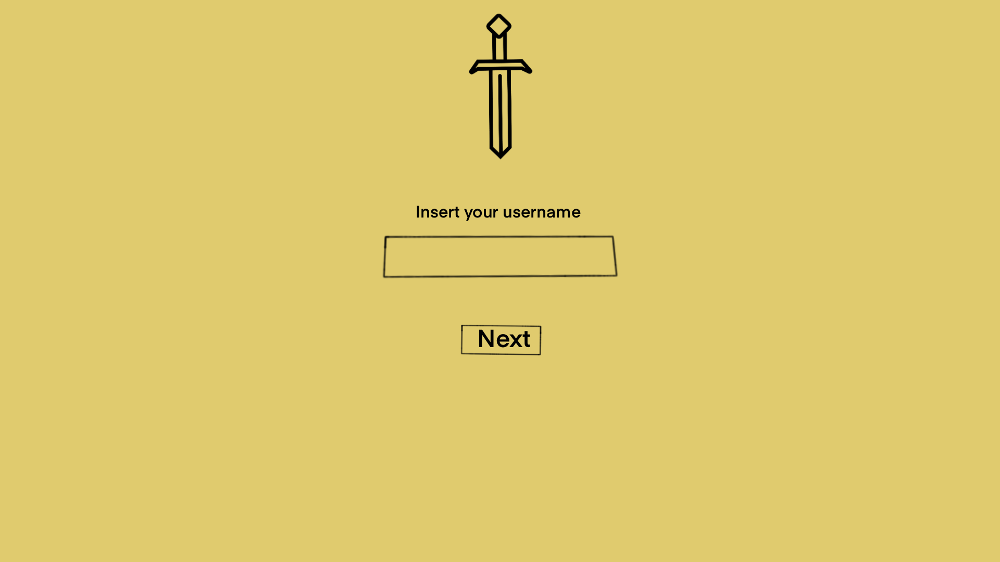
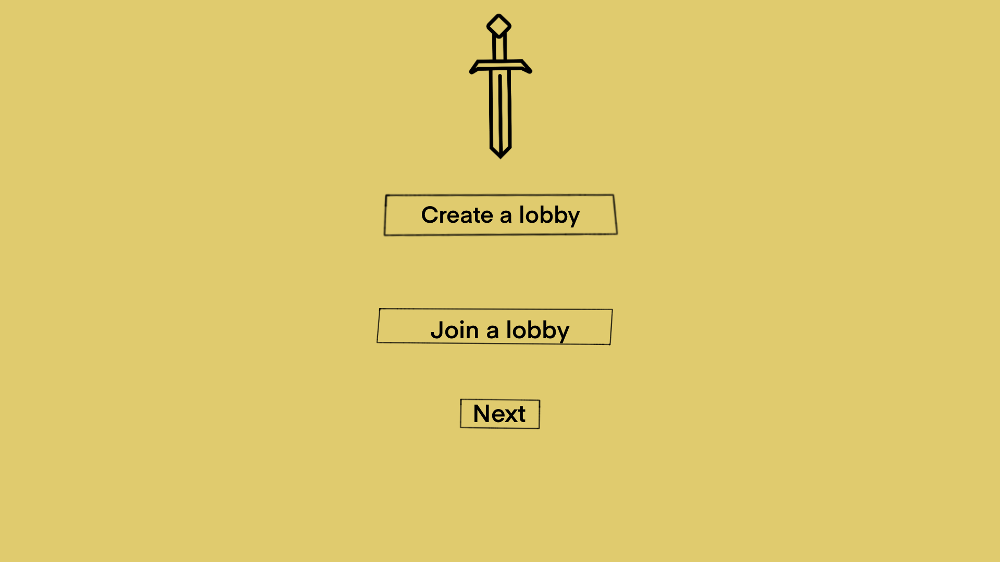
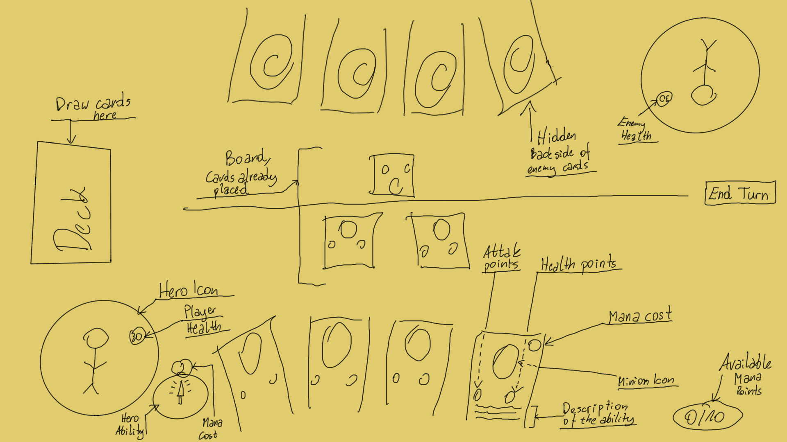

# Card Craft

## Introduction

CardCraft is a card battle game for 2 people, where the players use a complex strategies to fight between each other via
their card decks.

Before the battle begins, players construct their decks from a vast array of cards.
Deck building is a crucial aspect of CardCraft, as players must carefully develop their decks to go forward with their
chosen strategy and adapt to their opponent's tactics.

Each player has a set number of health points, representing their overall vitality in the game.
The primary objective is to deplete your opponent's health points to zero before they can do the same to you.

The game progresses through a series of rounds, with each round consisting of players taking turns to play cards from
their hands and deploy troops onto the battlefield.

Battles in CardCraft are resolved through a combination of card abilities (*should have*), attack values, health points and mana points.
Each card possesses specific attributes, such as attack strength, health, mana and special abilities (*should have*),
which determine its effectiveness in combat.

### About the developers

This game is being developed as a part of the Year 3, Period 3 courses at NHL Stenden University of Applied Sciences.
Below you can find the team members:

|        Name        | Student Nr |               Student email               |
|:------------------:|:----------:|:-----------------------------------------:|
| Krystian Wiazowski |  5039258   | krystian.wiazowski@student.nhlstenden.com |
| Alexandru Gumaniuc |  4970411   | alexandru.gumaniuc@student.nhlstenden.com |
|  Miroslav Penchev  |  4998960   |  miroslav.penchev@student.nhlstenden.com  |

## Description

This game will be an inspiration taken from the game named Hearthstone. The preview of the rules can be found
here: (https://hearthstone.fandom.com/wiki/Gameplay)

*General specifications:*

* Card game
* 2D view point
* Multiplayer mode only 
* To start, it will require **2 people**

### Installation Guide

.exe file containing the game will be provided alongside the GitHub link to the repository

Step 1: Run an exe file. 
Step 2: Start playing the game by following the `Play Guide`.

### Playing Guide

#### Phase 1
1. User inputs the username that he would like to be represented with. Needs to be at least 2 characters and not match the other player's username.
2. Player then needs to, choose a Hero, and then move on to complete his Playing deck. There is an option to select each card individually or by random. Press Finish to save the deck.
3. Player needs to go back by pressing Select Hero. Then press Start game with the Username and LobbyCode not being empty.
4. Player either joins an existing lobby, by inputting a lobby code, or creates a new one. 
5. He then is moved to a lobby that is either empty (waiting for a new player), or already with exisiting enemy player.
6. When 2 players are present in the lobby, the game is automatically started after 5 seconds.

#### Phase 2
1. The game is being played in Turns
2. Player selects cards to be placed on the board
3. The choice is between minions or spells. They can attack other minions or Hero.
4. The player has a limited amount of mana to play the card, since each of them has their own cost.
5. The game is concluded/won by depleting the another hero health to 0 or lost if your health reaches 0.

### Class Diagram

### Design Mockups
#### Icon

#### Splash Screen

#### User Naming

#### Lobby Screen

#### Game

### MoSCoW Analysis

|  Priority   |                                                      Task                                                      |
|:-----------:|:--------------------------------------------------------------------------------------------------------------:|
|  Must have  | Multiplayer mode Random card decks Input Validation Add new card/add a custom card Mana Points |
| Should have |              Special abilities Spell Save data (cards, user images) in the database                |
| Could have  |                                        Animations Player Icon                                          |
|  Wont have  |                                                Player Chat                                                 |

## Input & Output

### Input

|        Case         |   Type   | Conditions |
|:-------------------:|:--------:|:----------:|
| String Name | `String` | not empty, more than 2 characters, cannot match other player's name |
| String LobbyCode | `String` | not empty, more than 3 characters | 

### Output

There are no outputs except objects present in the game.

### Remarks

* Input will be validated
* Players with the same username cannot connect
* Lobby can be created only once with the same code

## Design Patterns used

* Observer Pattern
* Object Pool Pattern
* Decorator Pattern

## Threading used

* Async
* (Multi)Threading
* Task
* Lock 

