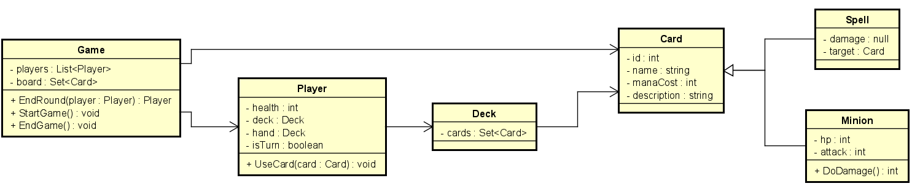

# Card Craft

## Introduction

CardCraft is a card battle game for 2 people, where the players use a complex strategies to fight between each other via
their card decks.

Before the battle begins, players construct their decks from a vast array of cards. Deck building is a crucial aspect of CardCraft, as players must carefully develop their decks to go forward with their chosen strategy and adapt to their opponent's tactics.

Each player has a set number of health points, representing their overall vitality in the game.
The primary objective is to deplete your opponent's health points to zero before they can do the same to you.

The game progresses through a series of rounds, with each round consisting of players taking turns to play cards from their hands and deploy troops onto the battlefield.

Battles in CardCraft are resolved through a combination of card abilities (*should have*), attack values, health points and mana points.
Each card possesses specific attributes, such as attack strength, health, mana and special abilities (*should have*), which determine its effectiveness in combat.

### About the developers

This game is being developed part of the course "Design Patterns" at NHL Stenden University of Applied Sciences.
Below you can find the team members:

|        Name        | Student Nr |               Student email               |
|:------------------:|:----------:|:-----------------------------------------:|
| Krystian Wiazowski |  5039258   | krystian.wiazowski@student.nhlstenden.com |
| Alexandru Gumaniuc |  4970411   | alexandru.gumaniuc@student.nhlstenden.com |
|  Miroslav Penchev  |  4998960   |  miroslav.penchev@student.nhlstenden.com  |

## Description

This game will be an inspiration taken from the game named Hearthstone. The preview of the rules can be found
here: (https://hearthstone.fandom.com/wiki/Gameplay)

*General specifications:*

* Card game
* 2D view point
* Multiplayer mode only (connected via the same LAN Network)
* To start, it will require  **2 people**

### Class Diagram

### Design Mockups

![Design]

#### Game

![Game]

## Input & Output

*The section below is yet to be updated*

### MoSCoW Analysis

|  Priority   |                                                      Task                                                      |
|:-----------:|:--------------------------------------------------------------------------------------------------------------:|
|  Must have  | Multiplayer mode Random card decks Input Validation Add new card/add a custom card Mana Points |
| Should have |              Special abilities Spell Save data (cards, user images) in the database                |
| Could have  |                                        Animations Player Icon                                          |
|  Wont have  |                                                Player Chat                                                 |

### Input

|        Case         |   Type   | Conditions |
|:-------------------:|:--------:|:----------:|
| Example exampleName | `String` | not empty  |

### Output

|  Case   |   Type   |
|:-------:|:--------:|
| Example | `String` |

### Calculations

|  Case   |    Calculation    |
|:-------:|:-----------------:|
| Example | `Example*Example` |

### Remarks

* Input will be validated
* Players with the same username cannot connect
* Lobby can be created only once with the same code

## Design Patterns used

*To be updated*

