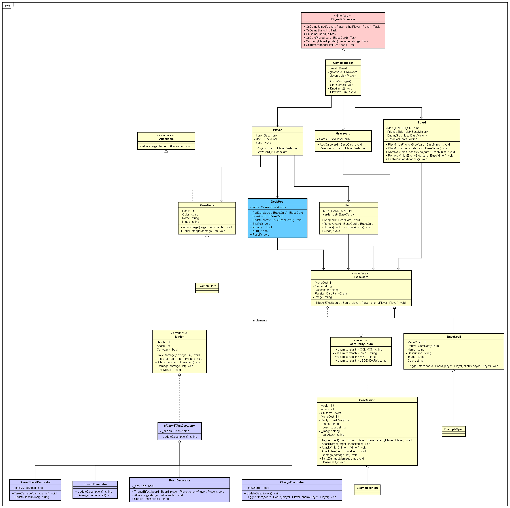
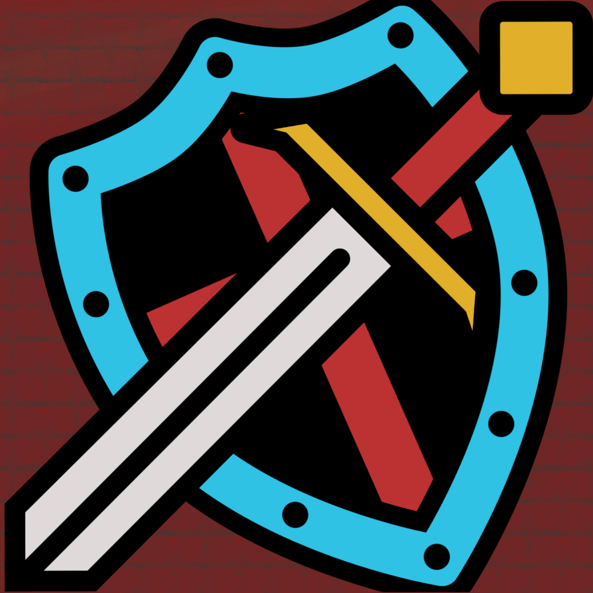

# Card Craft

## Introduction

CardCraft is a card battle game for 2 people, where the players use a complex strategies to fight between each other via
their card decks.

Before the battle begins, players construct their decks from a vast array of cards.
Deck building is a crucial aspect of CardCraft, as players must carefully create their decks to go forward with their
chosen strategy and adapt to their opponent's tactics.

Each player has a set number of health points, representing their overall vitality in the game.
The primary objective is to deplete your opponent's health points to zero before they can do the same to you.

The game progresses through a series of turns, with each round consisting of players taking turns to play cards from
their hands and deploy minions onto the battlefield (board). Every minion has a specific mana cost that is deducted from Player's available mana pool.

Battles in CardCraft are resolved through a combination of card abilities (*should have*), attack values, health points and mana points.
Each card possesses specific attributes, such as attack strength, health, mana and special abilities (*should have*),
which determine its effectiveness in combat.

### About the developers

This game is being developed as a part of the Year 3, Period 3 courses at NHL Stenden University of Applied Sciences.
Below you can find the team members:

|        Name        | Student Nr |               Student email               |
|:------------------:|:----------:|:-----------------------------------------:|
| Krystian Wiazowski |  5039258   | krystian.wiazowski@student.nhlstenden.com |
| Alexandru Gumaniuc |  4970411   | alexandru.gumaniuc@student.nhlstenden.com |
|  Miroslav Penchev  |  4998960   |  miroslav.penchev@student.nhlstenden.com  |

## Description

This game will be an inspiration taken from the game named Hearthstone. The preview of the rules can be found
here: (https://hearthstone.fandom.com/wiki/Gameplay)

*General specifications:*

* Card game
* 2D view point
* Multiplayer mode only (you need internet connection)
* A game requires **2 users** to start

### Installation Guide
Prerequisites: Visual Studio IDE, .NET 8.0 installed, .NET Maui framework installed.

Step 1: Clone the repository from the following the link: https://github.com/Geniools/CardCraft.git 
Step 2: Install the latest version *Visual Studio*  
Step 3: Install **.NET Maui** framework, either within the IDE (VS Installer) or run "dotnet workload install maui". Use the following
link as a reference: https://learn.microsoft.com/en-us/dotnet/maui/get-started/installation?view=net-maui-8.0&tabs=vswin 
Step 4: Start Visual Studio and open the solution **(CardCraft.sln)**. 
Step 5: If prompted, install any other necessary dependencies. 
Step 6: If the solution is opened, press the Green arrow in the top toolbox section with "Windows Machine" option selected. 
Step 7: Game should load soon. 
Step 8: Start playing the game by following the `Play Guide`.

### Play Guide

#### Phase 1
1. User inputs the username that he would like to be represented with. Needs to be at least 2 characters.
2. Player then needs to, choose a Hero, and then move on to complete his Playing deck. There is an option to select each card individually or by random. Press Finish to save the deck.
3. Player needs to go back by pressing the *Select Hero*. Then press Start game with the Username and LobbyCode not being empty.
4. Player either joins an existing lobby, by inputting a lobby code, or creates a new one. 
5. He then is moved to a lobby that is either empty (waiting for a new player), or already with an existing enemy player.
6. When 2 players are present in the lobby, the game is automatically started after 5 seconds.

#### Phase 2
1. The game is being played in Turns. The player that goes first is randomly selected.
2. Player selects a cardsto be placed on the board															
3. The choice is between minions or spells. Each mininion has a cost of mana, attack and health points assigned to it. Spells have a cost of mana and a special ability.
(Read their description to know what they do).
4. The player has a limited amount of mana to play the card, since each of them has their own cost. The mana is being refilled each turn.
5. The game is concluded/won by depleting the another hero health to 0 or lost if your health reaches 0.

### Class Diagram

### Current Design

#### Start Page

#### Hero Selection

#### Card Choice

#### Lobby Page

#### Board View

#### Icon

### Design Mockups

#### Splash Screen

#### User Naming

#### Lobby Screen

#### Game

#### Icon

### MoSCoW Analysis

|  Priority   |                                                      Task                                                      |
|:-----------:|:--------------------------------------------------------------------------------------------------------------:|
|  Must have  | Multiplayer mode Random card decks Input Validation Add new card/add a custom card Mana Points |
| Should have |              Special abilities Spell Save data (cards, user images) in the database                |
| Could have  |                                        Animations Player Icon                                          |
|  Wont have  |                                                Player Chat                                                 |

# Technical details
This chapter will describe what are the technical specifications of this application, what was used and why.

### * Using .NET MAUI Framework
### * Using .NET version 8.0
### * SignalR Server

### Input

|       Case       |   Type   |                              Conditions                              |
|:----------------:|:--------:|:--------------------------------------------------------------------:|
|   String Name    | `String` | not empty, between 2 and 12 characters, cannot match other player's name, no special characters or whitespaces  |
| String LobbyCode | `String` |                  not empty, between 2 and 6 characters, can only contain numbers or letters                   | 

### Output

|       Case       |   Type   |                  Conditions                   |
|:----------------:|:--------:|:---------------------------------------------:|
|  Player Player1  | `Player` | If opponent's health reaches 0 first, you win |
 

### Calculations 

1. Determining a winner: if(Player1Hero Health = 0 ){ Player2Hero wins} elseif( Player2Hero Health = 0) Player1Hero wins}
2. Cards attacking: Cards can attack each other, reducing the enemy's card health by the amount of attack points assigned to that card.
3. Mana Deduction: Cards and spells deduct their assigned (cost) Mana points from the available to the player pool (of mana). 

### Remarks

* Input will be validated
* Players with the same username cannot connect
* Lobby can be created only once with the same code

### Design Patterns used

* Observer Pattern - This patterns lets you notify objects, when a certain event occurs. 
In this project, the Game Manager is the subscriber, that gets informed about all the events so that it can update necessary methods. 
The SignalR server is the place that holds all the observers in a list. ISignalRObserver class is the publisher    
* Object Pool Pattern - Lets you reuse instances of classes and avoid instantiating them again. The Deck is a using the Object Pool Pattern, since
the player only makes a deck once, and is updated afterwards depending on game's conditions  
* Decorator Pattern - This pattern was used to make the game expandable and flexible. Having this allows us to build on top of the base card by adding
new funcitonalities, such as *DevineShield* or *Taunt*...

### Threading used

* Async - For server responses and methods. Allows background processes to continue functioning without slowing down or being stopped by methods.  
* (Multi)Threading - Helps making the game run few processes/threads simultanously and the keep the GUI responsive.  
* Task - For working with async inputs and outputs, managing concurrent actions and executing mutliple tasks.  
* Lock - Locks an object that is used in the thread so that the other thread does not use it. Used in adding and removing cards to the deck. Present in few methods in DeckPageViewModel class.
* Async I/O - Allows the app run in the background, while the threads are still not finished.

### Cards Spreadsheet (not updated)

#### *Cards*
|       Name       |   Rarity    | ManaCost | Attack | Health |
|:----------------:|:-----------:|:--------:|:------:|:-----:|
|       Alex       | `LEGENDARY` |    10    |   10   |   10  |
|       Miro       |   `EPIC`    |    9     |   9    |   9   | 
|     Krystian     |   `EPIC`    |    9     |   9    |   9   |
|      Evald       |  `COMMON`   |    2     |   3    |   4   |
|      Mathew      |  `COMMON`   |    6     |   5    |   3   |
|      Corvin      |  `COMMON`   |    4     |   4    |   4   |
|     Dimitri      |   `RARE`    |    7     |   5    |   5   |
|      Andrei      |  `COMMON`   |    5     |   5    |   5   |
|       Rob        |  `COMMON`   |    4     |   5    |   5   |
|      Jadyn       |  `COMMON`   |    5     |   4    |   4   |
|      Nathan      |  `COMMON`   |    2     |   3    |   3   |
|      Terry       |  `COMMON`   |    5     |   3    |   3   |
|       Teo        |  `COMMON`   |    5     |   5    |   3   |
|      Arian       |  `COMMON`   |    1     |   2    |   3   |
|      Woman       |   `EPIC`    |    8     |   7    |   7   |
|     Teacher      |   `EPIC`    |    8     |   8    |   8   |
|   Security Guy   |    `RARE`    |    6     |   6    |   4   |
|    Buff Jadyn    |     `RARE`        |  7       |   7    |   6   |
| CrackedUp Mathew |      `RARE`       |    8     |  8     |   4   |
|     BakiTeo      |     `RARE`        |    9     |   8    |  7    |

#### *Spells*
|           Name           |   Rarity    | ManaCost |                        Description                        |
|:------------------------:|:-----------:|:--------:|:---------------------------------------------------------:|
|          Resit           |   `EPIC`    |    7     |    Remove 2 Health from each minion in enemy Hero hand    |
|           Exam           |  `COMMON`   |    3     |           Remove 2 Mana points from enemy Hero            | 
|     Corridor Coffee      |  `COMMON`   |    0     |                  Adds 2 Mana to the Hero                  |
|  Information Management  |   `RARE`    |    6     |   Remove 2 Attack points from each minion in enemy Hand   |
|        Coding Bug        |  `COMMON`   |    1     |                Deal 1 damage to enemy Hero                |
|      Dutch housing       |  `COMMON`   |    3     |                Deal 2 damage to enemy Hero                |
|      Landlord visit      |   `EPIC`    |    8     |               Remove 6 Mana from enemy Hero               |
|           773            | `LEGENDARY` |    10    |                Deal 8 damage to enemy Hero                |
|     6.1 Projec Resit     |  `COMMON`   |    4     |               Remove 2 Mana from enemy Hero               |
|      Nice Argument       |   `EPIC`    |    8     |         Remove 1 enemy minion Card from the Board         |
|        Alcoholism        |   `RARE`    |    6     |    Give 2 Attack points to each minion in player hand     |
|     IT Relationship      |  `COMMON`   |    3     |                   Give 2 Health to Hero                   |
|          Tated           |   `EPIC`    |    9     | Tates 1 enemy minion, change their health and attack to 1 |
|     Belastindgienst      |   `RARE`    |    5     |                Deal 4 Damage to enemy Hero                |
|           Pray           |  `COMMON`   |    2     |             Add 1 health point to Player/Hero             |
|           Gym            |  `COMMON`   |    3     |                Deal 2 damage to enemy Hero                |
|          Amogus          |   `RARE`    |    5     |           Remove 1 minion from enemy Hero hand            |
|       Lorem Ipsum        |  `COMMON`   |    0     |                    Give 1 Mana to Hero                    |
| IT Relationship Upgraded |   `RARE`    |    6     |                   Give 4 Health to Hero                   |
|         IoT Lab          |  `COMMON`   |    0     |                    Give 2 Mana to Hero                    |

